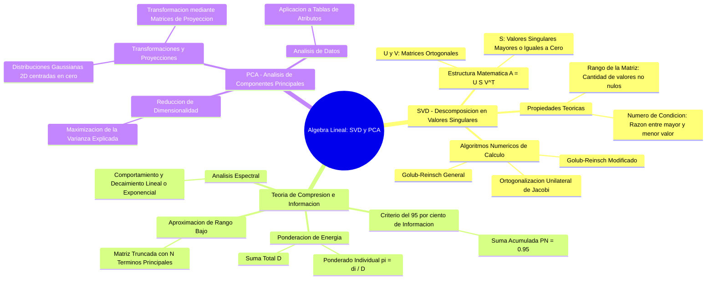

# Actividad #03 - Maching Learning
- Christian Marroquin
- Julian Medina
# actividad
- Generar descomposicion de valores singulares de una imagen de dimensiones (1920, 1080). Para luego eliminar los elementos menores que aporten menos del 5% a la suma de los valores singulares.
- Pasar el resultado anterior a otro grupo y recibir la descomposicion de otro grupo para reconstruir la imagen que descompusieron.
- Generar estadisticas para los valores singulares de las 6 imagenes adjuntas, para ver como decaen los valores singulares.
- Generar una nube de puntos 2D con distribusion gaussiana, luego aplicarle la siguiente matriz
Para ver la matriz en GitHub, escribe el bloque así:
$$
\begin{bmatrix}
1 & 2 \\
-1 & 0
\end{bmatrix}
$$
y aplicarle un analisis de componentes principales a la distribucion de punto final.
- Aplicarle el analisis de componentes principales a los datos en el archivo sol_objects.csv
- Construya un mapa mental del tema

